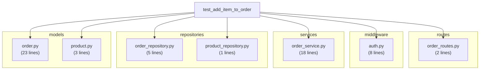

# Example Diagram: test_add_item_to_order

This scenario tests adding an item to an order through all 5 layers:
**route -> middleware -> service -> repository -> model**

## Scenario Diagram



## How this was generated

```bash
# 1. Run tests with coverage
uv run pytest tests/ --cov=src --cov-context=test

# 2. Collect scenario metadata
uv run pytest-tracer collect . -o scenarios.json

# 3. Build trace index
trace build --coverage .coverage --scenarios scenarios.json --output .trace-index

# 4. Generate diagram
trace diagram "tests/test_order_flow.py::test_add_item_to_order" --index .trace-index

# 5. Extract mermaid to a viewable file
trace diagram "tests/test_order_flow.py::test_add_item_to_order" --index .trace-index \
  | python3 -c "
import sys, json
m = json.load(sys.stdin)['mermaid']
print('```mermaid')
print(m)
print('```')
" > diagram.md
```

## Viewing the diagram

- **GitHub**: Renders mermaid blocks natively in `.md` files
- **VS Code**: Install [Markdown Preview Mermaid Support](https://marketplace.visualstudio.com/items?itemName=bierner.markdown-mermaid) (`bierner.markdown-mermaid`), then Cmd+Shift+V to preview
- **Web**: Paste mermaid source at https://mermaid.live
