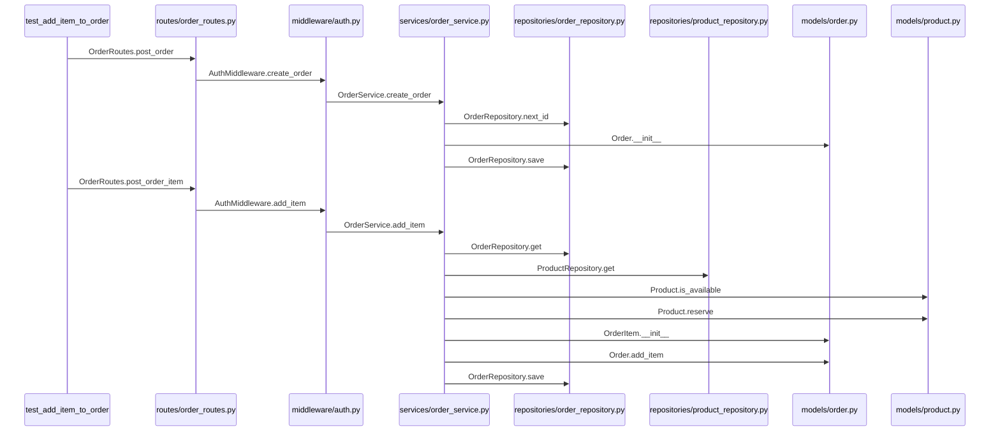
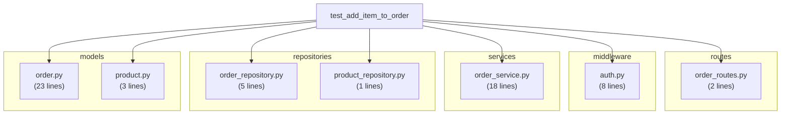

# Example Diagrams: test_add_item_to_order

This scenario tests adding an item to an order through all 5 layers:
**route -> middleware -> service -> repository -> model**

## Call-Chain Sequence Diagram (from sys.monitoring traces)

This shows the actual function calls in order, with arrows between files:



## Coverage Diagram (from pytest-cov line coverage)

This shows which files are touched, grouped by directory:



## How this was generated

```bash
# 1. Run tests with coverage
uv run pytest tests/ --cov=src --cov-context=test

# 2. Collect scenario metadata
uv run pytest-tracer collect . -o scenarios.json

# 3. Collect call traces (uses sys.monitoring)
uv run pytest-tracer trace . -o call_traces.json

# 4. Build trace index with call traces
trace build --coverage .coverage --scenarios scenarios.json \
  --call-traces call_traces.json --output .trace-index

# 5. Generate sequence diagram (call chain)
trace flamegraph "tests/test_order_flow.py::test_add_item_to_order" \
  --format mermaid --index .trace-index

# 6. Generate folded stacks (for speedscope flame graph viewer)
trace flamegraph "tests/test_order_flow.py::test_add_item_to_order" \
  --index .trace-index > profile.folded

# 7. Generate coverage diagram
trace diagram "tests/test_order_flow.py::test_add_item_to_order" --index .trace-index
```

## Viewing

- **Sequence diagrams**: GitHub renders mermaid natively. VS Code needs the "Markdown Preview Mermaid Support" extension (`bierner.markdown-mermaid`)
- **Flame graphs**: Load the folded stacks file in [speedscope](https://www.speedscope.app/) or pipe through `flamegraph.pl`
